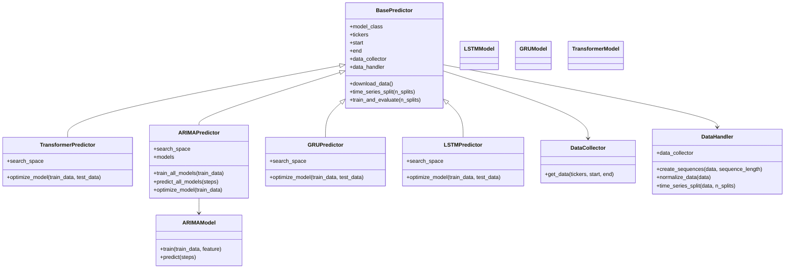
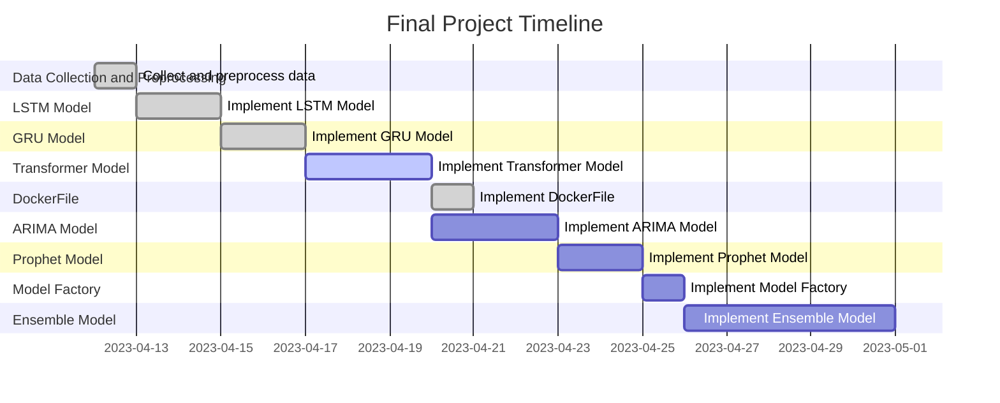

## CPSC393 Final Project

A comprehensive stock market prediction system utilizing an ensemble of machine learning techniques, including LSTM, GRU, ARIMA, Transformer, and Prophet models. Designed to analyze and predict stock prices, this project showcases a comparative study of different algorithms and their effectiveness in predicting financial market trends, while leveraging the power of ensemble methods for improved accuracy and robustness.

## Prerequisites

Python 3.8+
Pandas
NumPy
Scikit-learn
Scikit-optimize
TensorFlow
Keras
Statsmodels
Matplotlib
Docker

### Setup and Usage
This section combines the instructions for installing Docker and using the Jupyter notebook 'Testing.ipynb' to train and evaluate the models.

### Docker Installation
Install Docker on your machine if you haven't already.
[Docker Desktop Download](https://www.docker.com/products/docker-desktop/)
### Building the Docker Image
To build the Docker image, navigate to the project directory and run the following command:

```bash
docker build -t cpsc393_stock_pred .
```
### Running the Docker Container
After building the Docker image, you can run the project using the following command:

```bash
docker run -it --rm -p 8000:8000 cpsc393_stock_pred
```
A link will be given in the terminal. Copy and paste the link into your browser to access the Jupyter notebook. The testing notebook is called 'Testing.ipynb'.

### Shutting Down the Docker Container
To shut down the Docker container, press Ctrl+C in the terminal.


- **Always remember to shut down the Docker container** when you are done using it. If you do not shut down the container, it will continue to run in the background and use up your computer's resources.

### file structure

├── main.py
├── Models/
│   ├── __init__.py
│   ├── lstm_model.py
│   ├── gru_model.py
│   ├── arima_model.py
│   └── transformer_model.py
├── Data/
│   ├── __init__.py
│   ├── data_collector.py
│   └── data_handler.py
└── Predictors/
    ├── __init__.py
    ├── base_predictor.py
    ├── lstm_predictor.py
    ├── gru_predictor.py
    ├── arima_predictor.py
    └── transformer_predictor.py

##  current class diagram


---

## Here's a high-level description of how the current code works:

1. **Data Collection**: The **'DataCollector'** class in the **'data_collector.py'** module is responsible for downloading stock data from online sources (e.g., Yahoo Finance) based on the provided tickers, start, and end dates. This data is then stored in a Pandas DataFrame.

2. **Data Processing**: The **'DataHandler'** class in the **'data_handler.py'** module processes and prepares the data for use in the models. This includes creating sequences of data for time series modeling, splitting the data into train and test sets using time series cross-validation, and scaling the data when necessary.

3. **Model Creation**: The **'BasePredictor'** class in the **'predictor.py'** module serves as a base class for the specific predictor classes for LSTM, GRU, ARIMA, Transformer, and Prophet models (i.e., LSTMPredictor, GRUPredictor, ARIMAPredictor, TransformerPredictor, and ProphetPredictor). These predictor classes use a factory design pattern to create instances of the corresponding models, which are implemented in the Models directory.

4. **Hyperparameter Optimization**: Each predictor class defines a search space for hyperparameter optimization using Scikit-optimize's **'gp_minimize'** function. This function searches for the best hyperparameters for each model by minimizing the mean squared error (MSE) on the validation set.

5. **Model Training and Evaluation**: After finding the best hyperparameters for each model, the models are trained on the entire training set, and their performance is evaluated on the test set. The **'train_and_evaluate'** method of each predictor class handles this process.

6. **Visualization**: The **'StockVisualizer'** class in the **'stock_visualizer.py'** module provides visualization tools for comparing the predictions of the models with the actual data. This helps in understanding the accuracy and effectiveness of the models.

Functionality for the Transformer and Prophet models will be added in the future. The **'EnsembleModel'** class will be used to combine the predictions of the different models into a single prediction. This will be done by taking a weighted average of the predictions of the individual models, where the weights are determined by the performance of each model on the test set.

The use of a factory design pattern allows for easy addition and modification of different model types in the project. By extending the BasePredictor class and implementing the necessary methods, new models can be added to the project with minimal changes to the existing codebase. This design pattern helps maintain the modularity and flexibility of the project.

## Timeline

We will be finished with the project by May 1st.

The following is a timeline of the project.
Gray boxes are completed tasks, Glowing Blue boxes are tasks in progress, and Blue boxes are tasks that are yet to be completed.




### Legal

Disclaimer: Student Project, Not Intended for Actual Use

This software is a student project developed for educational purposes only. It is not intended to be used for any commercial or professional purpose, including but not limited to trading, investment, or financial decision-making.

The creators of this software, including AM, HF, JM, and TG, as well as their affiliated educational institution, make no representations or warranties, express or implied, regarding the accuracy, reliability, or completeness of the information or predictions provided by this software.

By using this software, you acknowledge that the creators and their affiliated educational institution shall not be held liable for any errors, omissions, or inaccuracies in the information provided, nor any direct, indirect, incidental, consequential, special, or exemplary damages resulting from your reliance on or use of this software.

You also acknowledge that this software should not be used as a substitute for professional financial advice, and any investment or financial decisions should be made after consulting with a qualified financial professional.