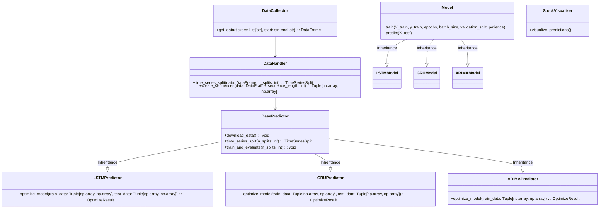

<<<<<<< HEAD
## CPSC393 Final Project

A comprehensive stock market prediction system utilizing an ensemble of machine learning techniques, including LSTM, GRU, and ARIMA models. Designed to analyze and predict stock prices, this project showcases a comparative study of different algorithms and their effectiveness in predicting financial market trends, while leveraging the power of ensemble methods for improved accuracy and robustness

## Prerequisites

Python 3.8+
Pandas
NumPy
Scikit-learn
Scikit-optimize
TensorFlow
Keras
Statsmodels
Matplotlib

## Installing

### Clone the repository
```bash
git clone https://github.com/xandermuse/CPSC393_Final.git
```

change directory to the project folder
```bash
cd CPSC393_Final
```

## Running the project

The Jupyter notebook 'USAGE.ipynb' contains all the nessesary code to use the project to train and evaluate the models.

## Class Diagram
Originally, we had a class diagram that looked like this:


### current class diagram

This is the current functionality of the project, which is a bit different from the original design. We still need to add the Transformer and Prophet models, as well as the Ensemble model.



### Here's a high-level description of how the current code works:

1. **Data Collection**: The **'DataCollector'** class in the **'data_collector.py'** module is responsible for downloading stock data from online sources (e.g., Yahoo Finance) based on the provided tickers, start, and end dates. This data is then stored in a Pandas DataFrame.

2. **Data Processing**: The **'DataHandler'** class in the **'data_handler.py'** module processes and prepares the data for use in the models. This includes creating sequences of data for time series modeling, splitting the data into train and test sets using time series cross-validation, and scaling the data when necessary.

3. **Model Creation**: The **'BasePredictor'** class in the **'predictor.py'** module serves as a base class for the specific predictor classes for LSTM, GRU, and ARIMA models (i.e., LSTMPredictor, GRUPredictor, and ARIMAPredictor). These predictor classes use a factory design pattern to create instances of the corresponding models, which are implemented in the Models directory.

4. **Hyperparameter Optimization**: Each predictor class defines a search space for hyperparameter optimization using Scikit-optimize's **'gp_minimize'** function. This function searches for the best hyperparameters for each model by minimizing the mean squared error (MSE) on the validation set.

5. **Model Training and Evaluation**: After finding the best hyperparameters for each model, the models are trained on the entire training set, and their performance is evaluated on the test set. The **'train_and_evaluate'** method of each predictor class handles this process.

6. **Visualization**: The **'StockVisualizer'** class in the **'stock_visualizer.py'** module provides visualization tools for comparing the predictions of the models with the actual data. This helps in understanding the accuracy and effectiveness of the models.

Functionality for the Transformer and Prophet models will be added in the future. The **'EnsembleModel'** class will be used to combine the predictions of the different models into a single prediction. This will be done by taking a weighted average of the predictions of the individual models, where the weights are determined by the performance of each model on the test set.

The use of a factory design pattern allows for easy addition and modification of different model types in the project. By extending the BasePredictor class and implementing the necessary methods, new models can be added to the project with minimal changes to the existing codebase. This design pattern helps maintain the modularity and flexibility of the project.


## TimeLine

We will be finished with the project by May 1st. 

The following is a timeline of the project.
Gray boxes are completed tasks, Glowing Blue boxes are tasks in progress, and Blue boxes are tasks that are yet to be completed.


=======
# CPSC393_Final
CPSC393 Final Project: Stock market prediction system using an ensemble of LSTM, GRU, and ARIMA models. The project compares these algorithms' effectiveness and leverages ensemble methods for improved accuracy
>>>>>>> bf6f53efa8b6616c380ed39a39f9ce23acb4e057
